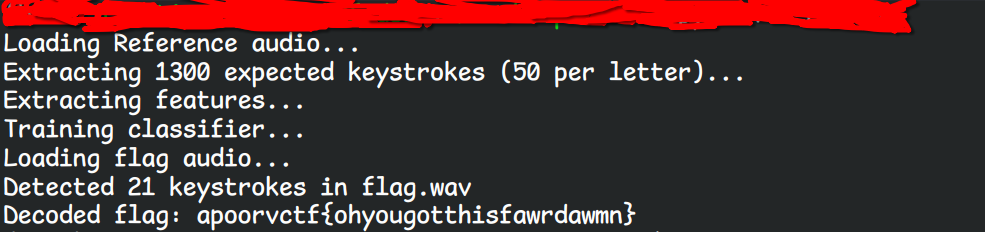

>Author on the Run 

>Flag:apoorvctf{ohyougotthisfardamn}

Author:nnnnn
Description:

No time to explain! The organizers are after me — I stole the flag for you, by sneakily recording their keyboard.

I managed to capture their keyboard keypresses before the event— every key (qwertyuiopasdfghjklzxcvbnm) pressed 50 times—don’t ask how. Then, while they were uploading the real challenge flag to CTFd, I left a mic running and recorded every keystroke.

Now I’m on the run If the organizers catch you with this, you never saw me. Good luck — and hurry!

Files:
Flag.wav
Reference.wav

link:https://drive.google.com/drive/folders/1GZ8wQggKkCWaWBONHGvfUM8ck3s-44Ai?usp=sharing

>Background(skip to solution if you want):

When I was creating this challenge, I wanted to share an interesting attack that is physically posisble, and I found fascinating, Using just a Parabolic mic, and some training data, attackers could literally know your passwords, by recording your keyboard..

Three major Research paper shaped this attacks , 
- **Asonov & Agrawal (2004):Keyboard Acoustic Emanations
- **Zhuang et al. (2009)**:Keyboard Acoustic Emanations Revisited
- **Compagno et al. (2017)**:Don’t Skype & Type! Acoustic Eavesdropping in Voice-Over-IP

These attacks got sophisticated year by year,
Key things I would like to note down, after reading these research papers are as follows:

- Every Mechanical keyboard has different keys, each of which have a slightly different key travel, which causes distinct sound when pressed for each keys, This key sound distinction is core to our attack, What we do , is record all of these sounds multiple times, and train on them, actually, This is pretty interesting stuff to me, as, Mechanical keyboards have different type of mechanical switches, each having different intensity of sounds, Blue is the loudest, Brown is Tactile, but non clicky, and red/pink, with least amount of sound
- The attack works best with Blue or brown switches
- he 2004 paper found that the most identifiable sound of a keytap is not its loud peak, but, instead, its onset, the exact, explosive ms the plastic keycap hits the baseplate, not your finger touching the key.This is why,they kept a strict 10ms windows, after which,echo starts

- The 2009 paper by Zhuang specifically found that, keys can also echo, we need to keep this nuder consideration , A typical fast keyboard typer taks around 150ms to type(push,hold,release), To map the keyboard, Zhoung used Mel-Frequency Cepstral Coefficients(fancy terms for speech-recognition algorithm)
- Later the latest research by Compagno proved that ,instead of FFT and MFCCs, we should combine them and use, to get better accuracy 
-------------------------------------------------------

>Solution

We are given 2 files, Reference.wav and flag,wav
we need to decode flag.wav using the reference.wav

I will be Applying Random forest ML algorithm, as normal decision trees react strongly to slight changes in input data/bad alignment, while, Random Forest is more stable.One can also use KNN, I have not tried that

First, According to challenge, every key from qwertyuiopasdfghjklzxcvbnm is pressed around 50 times, 

As mentioned from the paper, it would be bad to assume, that, every keystroke is struck with exact force, hence, we divide the reference.wav into exactly 26 parts, and, then , every letter gets a block, we make other sounds compete within their block

We find 50 loudest peak in that specific block itself, for each letter, such that, all q's are fighing with only q's. 

now, I need to find exact ms when a click began , if i am even 10ms late, i would instead capture echo ,and all of our training data would be bad

How we do this, is find peak then
we first calculate RMS of energy, of background noise in 50ms peak
then we walk backwards from peak, until the energy is below the RMS WE CALCULATED, this is our starting point of our keytap

Now comes the ML part, we will give 3 things as feature matrix
:
1)FFT(the 10ms strikes)
2)MFCCs(The complete 150ms echo)
3)**Spectral Shape:** Centroids, bandwidth, and zero-crossing rates(The physical geometry of audio)

I feed this now to Random trees , 300 as estimator is pretty good, 
now, once trained, 

Now, as we have no idea, how many keystrokes are there, in the flag, we calculate mean volume of the complete audio file, and standard deviation too, and then, we keep the threshold above meanvalue+2/3standard deviations, this will filter out any noise, and, only give sharp taps of keys, which we can detect.

our classifier is ready to detect, now, we , run each of the peak taps through classifier,and its gives us the predication


Here is the Script:

```
#!/usr/bin/env python3
import numpy as np
import librosa
import soundfile as sf
from scipy.signal import find_peaks
from sklearn.ensemble import RandomForestClassifier
from sklearn.preprocessing import StandardScaler, LabelEncoder
import warnings
warnings.filterwarnings('ignore')

LETTERS = 'qwertyuiopasdfghjklzxcvbnm'
SR = 44100
NOISE_WINDOW_MS = 50
ONSET_WINDOW_MS = 150
SHORT_ENERGY_MS = 2
SEARCH_BACK_MS = 20

noise_win = int(NOISE_WINDOW_MS / 1000 * SR)
onset_win = int(ONSET_WINDOW_MS / 1000 * SR)
short_e_win = int(SHORT_ENERGY_MS / 1000 * SR)
search_back = int(SEARCH_BACK_MS / 1000 * SR)

def compute_short_time_energy(audio, frame_len):
    kernel = np.ones(frame_len) / frame_len
    return np.convolve(audio ** 2, kernel, mode='same')

def refine_onset(audio, rough_onset, sr):
    noise_start = max(0, rough_onset - noise_win - search_back)
    noise_end = max(0, rough_onset - search_back)
    if noise_end <= noise_start:
        return rough_onset
    noise_segment = audio[noise_start:noise_end]
    noise_rms = np.sqrt(np.mean(noise_segment ** 2)) if len(noise_segment) > 0 else 0
    threshold = max(noise_rms * 3, 1e-6)
    search_start = max(0, rough_onset - search_back)
    search_end = min(len(audio), rough_onset + int(0.005 * sr))
    segment = audio[search_start:search_end]
    ste = compute_short_time_energy(segment, short_e_win)
    above = np.where(np.sqrt(ste) > threshold)[0]
    if len(above) > 0:
        return search_start + above[0]
    return rough_onset

def extract_onset_features(seg, sr):
    features = []
    transient_samples = int(10 / 1000 * sr)
    transient = seg[:transient_samples]
    transient_windowed = transient * np.hanning(len(transient))
    fft_mag = np.abs(np.fft.rfft(transient_windowed))
    if np.max(fft_mag) > 0:
        fft_mag = fft_mag / np.max(fft_mag)
    n_fft_feats = 64
    features.extend(fft_mag[:n_fft_feats] if len(fft_mag) >= n_fft_feats else np.pad(fft_mag, (0, n_fft_feats - len(fft_mag))))
    n_fft = min(1024, len(seg))
    mfcc = librosa.feature.mfcc(y=seg, sr=sr, n_mfcc=20, n_fft=n_fft, hop_length=256)
    features.extend(np.mean(mfcc, axis=1))
    features.extend(np.std(mfcc, axis=1))
    if mfcc.shape[1] >= 3:
        delta = librosa.feature.delta(mfcc)
        features.extend(np.mean(delta, axis=1))
        features.extend(np.std(delta, axis=1))
    else:
        features.extend([0] * 40)
    spectral_centroid = librosa.feature.spectral_centroid(y=seg, sr=sr)
    features.extend([np.mean(spectral_centroid), np.std(spectral_centroid)])
    spectral_bandwidth = librosa.feature.spectral_bandwidth(y=seg, sr=sr)
    features.extend([np.mean(spectral_bandwidth), np.std(spectral_bandwidth)])
    spectral_rolloff = librosa.feature.spectral_rolloff(y=seg, sr=sr)
    features.extend([np.mean(spectral_rolloff), np.std(spectral_rolloff)])
    spectral_flatness = librosa.feature.spectral_flatness(y=seg)
    features.extend([np.mean(spectral_flatness), np.std(spectral_flatness)])
    zcr = librosa.feature.zero_crossing_rate(seg)
    features.extend([np.mean(zcr), np.std(zcr)])
    rms = librosa.feature.rms(y=seg)
    features.extend([np.mean(rms), np.std(rms)])
    result = np.array(features, dtype=np.float32)
    result[np.isnan(result) | np.isinf(result)] = 0
    return result

def detect_onsets_blind(audio, sr, expected_count=None):
    frame_len = int(0.003 * sr)
    ste = compute_short_time_energy(audio, frame_len)
    smooth_len = int(0.005 * sr)
    if smooth_len % 2 == 0:
        smooth_len += 1
    env = np.convolve(np.sqrt(ste), np.ones(smooth_len)/smooth_len, mode='same')
    min_dist = int(0.10 * sr)
    if expected_count is not None:
        lo, hi = 0.0, np.max(env)
        best_peaks = None
        for _ in range(200):
            mid = (lo + hi) / 2
            peaks, _ = find_peaks(env, height=mid, distance=min_dist)
            if len(peaks) == expected_count:
                best_peaks = peaks
                break
            elif len(peaks) > expected_count:
                lo = mid
            else:
                hi = mid
        peaks = best_peaks if best_peaks is not None else []
    else:
        threshold = np.mean(env) + 2 * np.std(env)
        peaks, _ = find_peaks(env, height=threshold, distance=min_dist)
    # Refine each peak to the exact energy onset
    refined_onsets = []
    noise_floor = np.median(env) * 0.5
    for peak in peaks:
        search_start = max(0, peak - int(0.02 * sr))
        segment = env[search_start:peak + 1]
        threshold = noise_floor + (env[peak] - noise_floor) * 0.1
        below = np.where(segment < threshold)[0]
        onset_pos = search_start + below[-1] if len(below) > 0 else search_start
        refined_onsets.append(onset_pos)
    return refined_onsets, len(peaks)

# --- TRAINING ---
print("Loading Reference audio...")
y_full, sr = librosa.load('Reference.wav', sr=None, mono=True)
EXPECTED_STROKES = len(LETTERS) * 50
print(f"Extracting {EXPECTED_STROKES} expected keystrokes (50 per letter)...")
ref_onsets, ref_count = detect_onsets_blind(y_full, sr, expected_count=EXPECTED_STROKES)
if ref_count != EXPECTED_STROKES:
    print(f"WARNING: Found {ref_count} keystrokes, expected {EXPECTED_STROKES}.")
# Chunk into groups of 50 per letter, refine onsets
all_segments = {}
onset_idx = 0
for letter in LETTERS:
    segs = []
    for _ in range(50):
        if onset_idx < len(ref_onsets):
            refined = refine_onset(y_full, ref_onsets[onset_idx], sr)
            end = min(refined + onset_win, len(y_full))
            seg = y_full[refined:end]
            if len(seg) < onset_win:
                seg = np.pad(seg, (0, onset_win - len(seg)))
            segs.append(seg)
            onset_idx += 1
    all_segments[letter] = segs

print("Extracting features...")
X_train = []
y_train = []
for letter in LETTERS:
    for seg in all_segments[letter]:
        X_train.append(extract_onset_features(seg, sr))
        y_train.append(letter)
X_train = np.array(X_train)
y_train = np.array(y_train)

print("Training classifier...")
scaler = StandardScaler()
X_sc = scaler.fit_transform(X_train)
le = LabelEncoder()
y_enc = le.fit_transform(y_train)
clf = RandomForestClassifier(n_estimators=300, max_features='sqrt', random_state=42, n_jobs=-1)
clf.fit(X_sc, y_enc)

# --- FLAG DECODING ---
print("Loading flag audio...")
flag_audio, flag_sr = librosa.load('flag.wav', sr=None, mono=True)
onsets, n_found = detect_onsets_blind(flag_audio, flag_sr, expected_count=None)
print(f"Detected {n_found} keystrokes in flag.wav")
flag_letters = []
for onset in onsets:
    end = min(onset + onset_win, len(flag_audio))
    seg = flag_audio[onset:end]
    if len(seg) < onset_win:
        seg = np.pad(seg, (0, onset_win - len(seg)))
    feat = extract_onset_features(seg, flag_sr)
    feat_sc = scaler.transform(feat.reshape(1, -1))
    pred = clf.predict(feat_sc)[0]
    letter = le.inverse_transform([pred])[0]
    flag_letters.append(letter)
flag_str = ''.join(flag_letters)
print(f"Decoded flag: apoorvctf{{{flag_str}}}")

```


<<<<<<< HEAD
After running this, we get:


=======
After running this, we get, 

>>>>>>> 06e6741 (update writeups)
the flag , when we try to verify spells, 

"oh you got this fawr dawmn", when checked, site says incorrect, which means, we could change it to ohyougotthisfardamn for it to spell correctly and try again, This is most probably due to noise or minute training data errors!!!!

