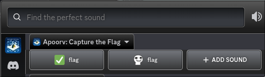
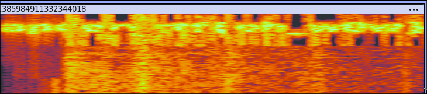

# Sanity Check 2

**Challenge Writeup**

| | |
|---|---|
| **CTF:** | apoorvCTF |
| **Category:** | Sanity Check |
| **Difficulty:** | Hard |
| **Author:** | makeki |
| **Flag:** | `apoorvctf{oh_w0w}` |

---

## Description

Well, you have joined our Discord server, right? Happy hunting.

---

## Solution

### 1. Hints

The following hints were posted publicly in the Discord server during the CTF:

1. The flag is within the server; no need to go outside.
2. The flag, if you see it, is the entire flag, not split into parts.
3. It has nothing to do with Discord bots.
4. It is not in a hidden channel.
5. For those who raised tickets: it is not in the GIF frames.

### 2. The Soundboard

The flag was in the voice channel. Discord has a **Soundboard** feature that lets server members play short audio clips. Both soundboard entries in the apoorvCTF server were named **flag**, making them reasonably easy to spot, if you thought to look there.



- **First sound (checkmark icon):** Plays a Morse code audio clip that decodes to `DADDY?`.
- **Second sound (skull icon):** Contains the flag, hidden in its spectrogram.

Soundboard audio can be downloaded directly via the Discord client. Once downloaded, opening the second file in **Audacity** and switching to the Spectrogram view reveals the flag.

### 3. Spectrogram Analysis



Reading the text encoded in the spectrogram gives the flag directly.

---

## Flag

```
apoorvctf{oh_w0w}
```
