# Journey

**OSINT Challenge Writeup**

| | |
|---|---|
| **CTF:** | apoorvCTF |
| **Category:** | OSINT |
| **Difficulty:** | Hard |
| **Author:** | makeki |
| **Flags:** | `apoorvctf{gggeb_C0d3_f0rc3s_9447192851}` |
| | `apoorvctf{gggeb_C0d3_f0rc3s_9447332138}` |
| | `apoorvctf{gggeb_C0d3_f0rc3s_6238958248}` |

---

## Description

The author of this challenge uses Discord.

**Flag format:** `apoorvctf{first_part_second_part_third_part}`

---

## Solution

### 1. Discord

We begin by navigating to the author's Discord profile.

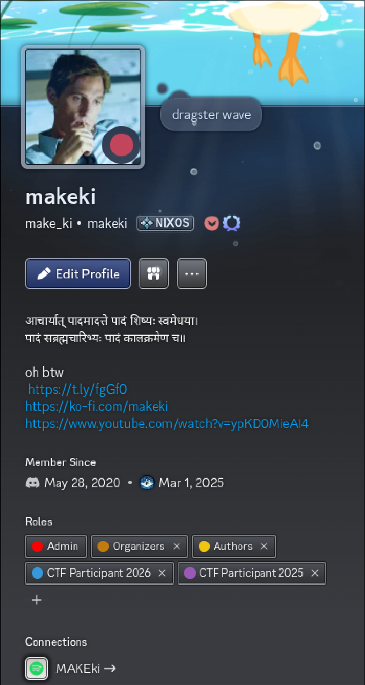

- **First link:** Leads to a wishlist (a dead end).
- **Third link:** Leads to a cigarette advertisement featuring Charlie Sheen.
- **Spotify:** Nothing of interest.
- **Second link (Ko-fi):** Leads to the author's Ko-fi page.

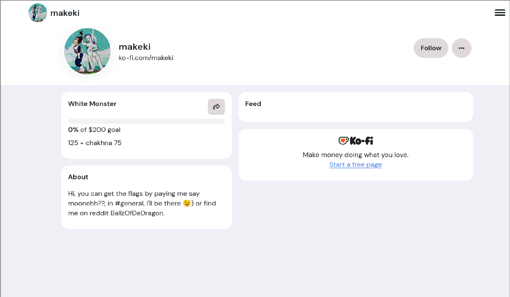

### 2. Reddit: BallzOfDeDragon

The Ko-fi page gives us a promising lead: a Reddit account named **BallzOfDeDragon**.

The account at https://www.reddit.com/user/BallzOfDeDragon/ has many posts and has been active for about a year.

The two oldest posts contain nothing of interest. However, the following post is significant:

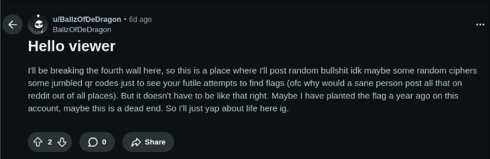

This confirms we are in the right place.

### 3. The Cipher Posts

#### ROT-8000

The next post contains the following:


This is a ROT-8000 cipher, which decodes to:

> "This is here for no absolute reason, who even uses ROT-8000." :)

#### Vigènere Cipher → Flag Part 1

The next post contains the following:

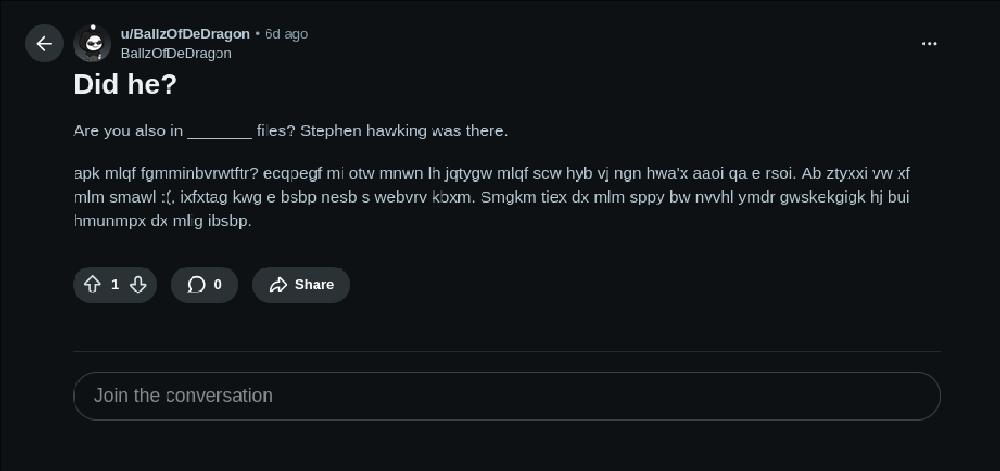

To experienced eyes, this is a Vigènere cipher. The key is **EPSTEIN**. Note that, in the context of an OSINT challenge, this cipher could have been decrypted even without knowing the key in advance.

The decrypted message reads:

> Was this brute-forceable? Regardless, it was straightforward to figure out if you follow the news. So, Vegeta is in the files. Epstein received an email from a dating site. The first part of the flag consists of the first five characters of that email's subject line.

Now that we know how to find the first flag part, we head to the DOJ's Epstein document archive at https://www.justice.gov/epstein and search for **vegeta**.

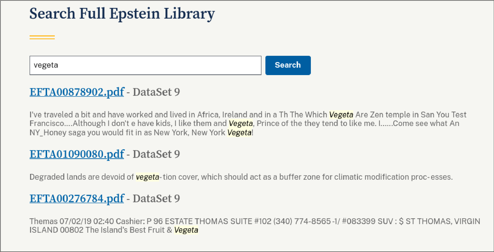

Of the results, only the first one is from an email.

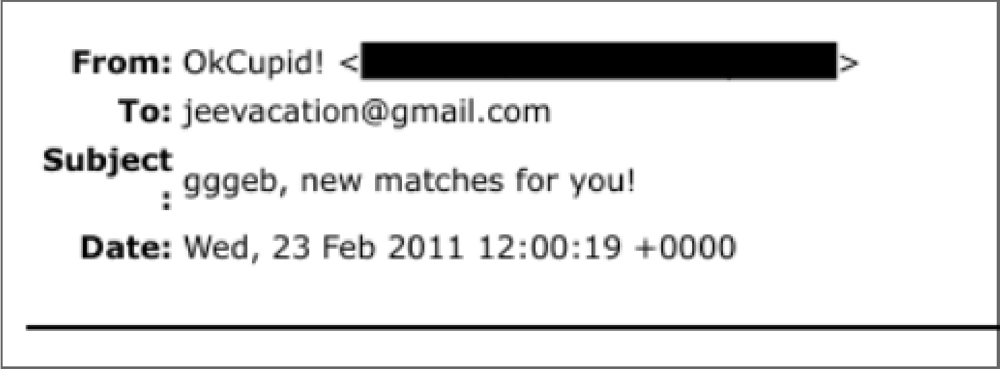

> **Flag Part 1:** `gggeb`

### 4. Roblox → Codeforces → Flag Part 2

Moving on to the next Reddit post:

It mentions two Roblox accounts. The first is a rabbit hole with nothing useful. The account to focus on is **guywithnoname54**.

> **Note:** It is important to perform a breadth-first search before going deep. From a solver's perspective, you should note all the information you encounter and continue reading before diving into any single lead. This writeup is not a strict walkthrough (that would be biased coming from the challenge creator). Think of it as a "here is where the flag was" guide.

As mentioned in support tickets: Part 2 requires some digging. The Roblox account leads somewhere, and that is where you will find the flag.

Many solvers did the digging and found my Roblox connections, which led them to **oGhostyy**'s profile. (He has a message encoded in binary in his description, a red herring that has been there since long before this challenge. It was amusing to see participants raising tickets about it.)

One of the featured communities on my Roblox profile is **QwErTy's Hangout**. Roblox communities have public walls and forums visible to other users. In the general discussion, there is a conversation between oGhostyy and guywithnoname54 about a platform called *battle-cp* (where "cp" stands for competitive programming). guywithnoname54 then mentions a Codeforces username.

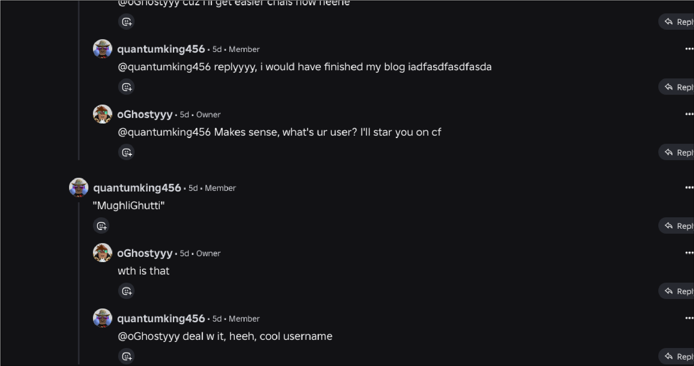

It is very intentionally placed inside quotation marks. If you read the context of the conversation: "easier challenges", "cp"; it becomes clear they are discussing **Codeforces**.

We head there and find the account.

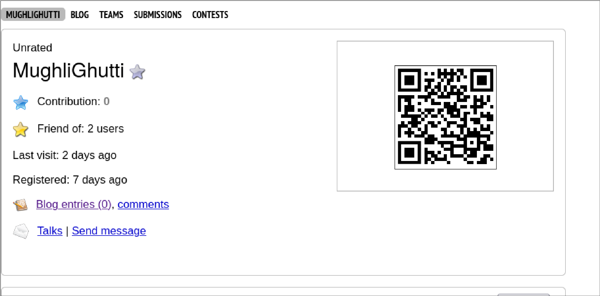

At this stage, there are two ways to obtain Part 2 of the flag.

#### Method A: YouTube (Unintended)

Scanning the QR code on the profile leads to a YouTube video. Sorting the comments by *Newest First* reveals a comment with my seal of authenticity.

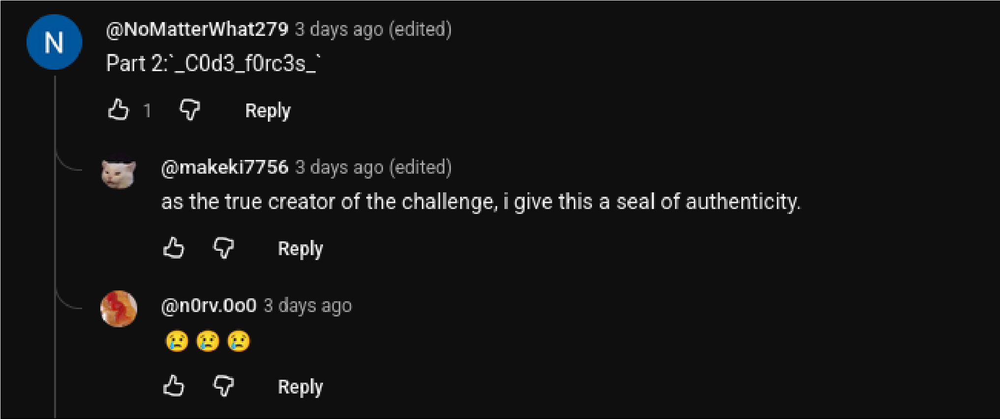

This comment was added a few minutes after the CTF began, when someone raised a ticket stating that new Codeforces accounts cannot view other users' submissions (a measure Codeforces uses to prevent data scraping for AI training). If your account was not classified as "new" by Codeforces standards, you could find the flag part through the intended method below.

#### Method B: Codeforces Submissions (Intended)

One can publicly view submissions made by any Codeforces user.

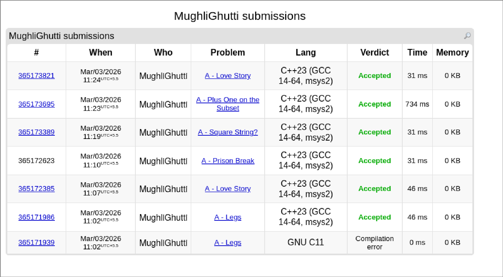

In one of those submissions, something is off compared to the rest.

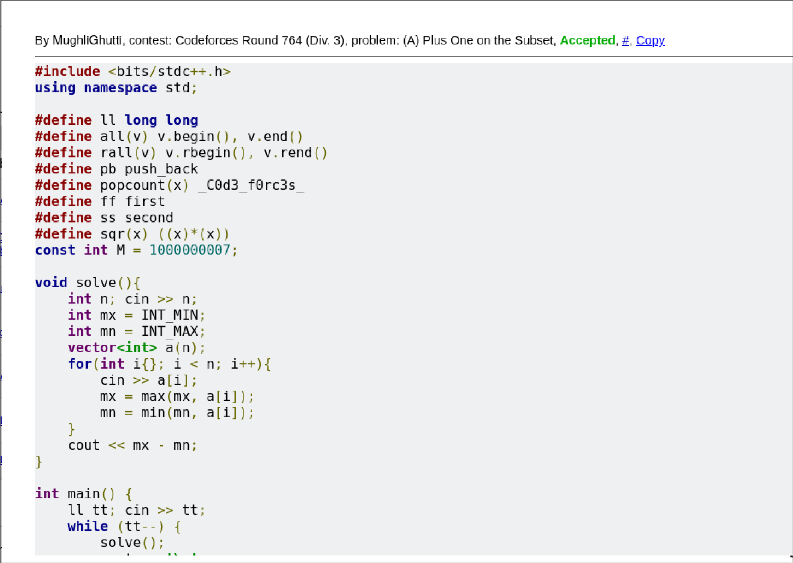

That is where you will find the intended Part 2.

### 5. Blogspot (m4k3k1) → Munnar, Kerala → Flag Part 3

The next Reddit post mentions that user **m4k3k1** writes blogs on Blogspot. Running `sherlock` on the username yields:

```
> sherlock m4k3k1

[*] Checking username m4k3k1 on:

[+] Blogger:        https://m4k3k1.blogspot.com
[+] Envato Forum:   https://forums.envato.com/u/m4k3k1
[+] dailykos:       https://www.dailykos.com/user/m4k3k1
[+] igromania:      http://forum.igromania.ru/member.php?username=m4k3k1
[+] mastodon.cloud: https://mastodon.cloud/@m4k3k1
[+] minds:          https://www.minds.com/m4k3k1/

[*] Search completed with 6 results
```

We navigate to the blog at https://m4k3k1.blogspot.com.

This is the stage where most participants spent the bulk of their time. The blog was *not* written with an OSINT challenge in mind, which I believe made this challenge feel much more realistic and engaging. There are many ways to determine the location.

> **Author's Note:** This writeup was composed under time pressure, so only a brief overview of the possible approaches is given here.

From context, the location is in **Kerala, India**. Here are the key clues from the blog:

1. The hill we climbed is roughly **four hours** from the Pala bus stand.
2. KSRTC bus schedules show a departure around **10 a.m.**, though our bus was delayed that day.
3. The phrases *"a sightseeing bus"* and *"Now who gets to go up and who stays down?"* indicate that our destination operates a **double-decker sightseeing bus**.

Clue 1 helps narrow the region, though the area is still large. Clues 2 and 3 together point strongly to **Munnar**.

#### Confirming Munnar via the Sightseeing Bus

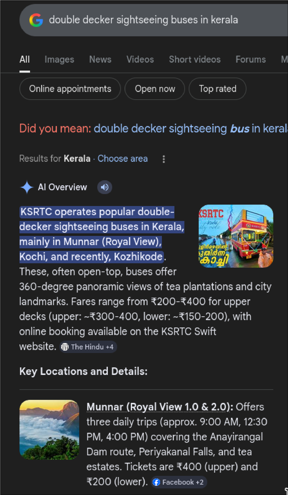

This exactly matches the description. Based on the timings mentioned in the blog, we could have caught the **4:00 PM** daily trip.

#### Confirming via Reverse Image Search

A reverse image search of the blog's photograph returns results with crosses that differ slightly from the one in the image. However, with enough effort, you could have determined the location was Munnar from this alone. Here I use the same image to verify our conclusion.

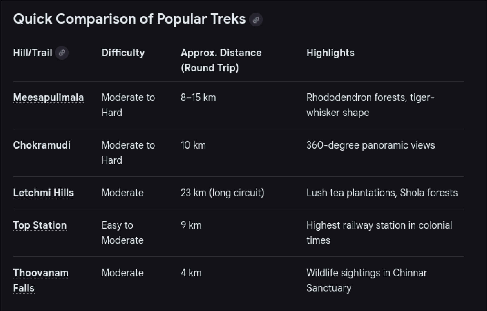

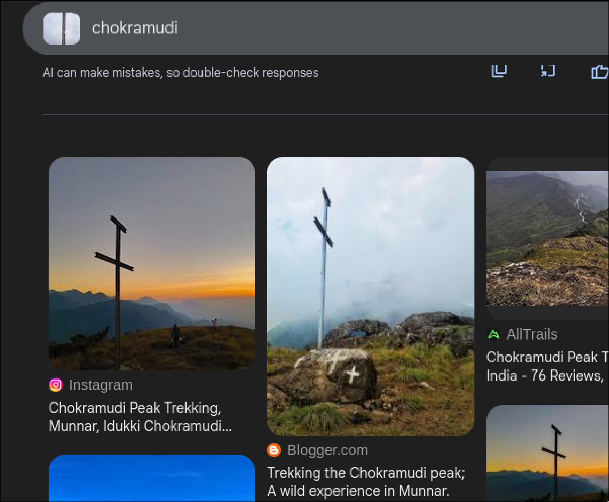

#### Narrowing the Route

We have now narrowed the location to Munnar. At this point, many participants submitted the phone numbers of every accommodation in Munnar. My response every time: READ THE DAMN BLOG.

A key excerpt from the blog:

> "The place we were to stay was away from the main town and the bus could just drop us there."

This tells us the accommodation is *not* in the main Munnar town, and that the sightseeing bus could drop guests off there on the return trip. The bus begins its journey from the Munnar KSRTC bus stand. The first search result describes its route:

> The service starts at the Munnar KSRTC bus stand. The bus then takes the Munnar GAP Road (NH 85, the Munnar-Poopara-Bodimettu route) to its final destination, Anayirangal Dam. Tourists also get to see Periyakanal Waterfalls, Signal Point, Lockhart View, Rock Cave (Malaikallan Cave), Orange Farm View, and tea estates en route. "We stop at each spot for 10 minutes."

So our stay is somewhere **between the bus stand and Anayirangal Dam**.

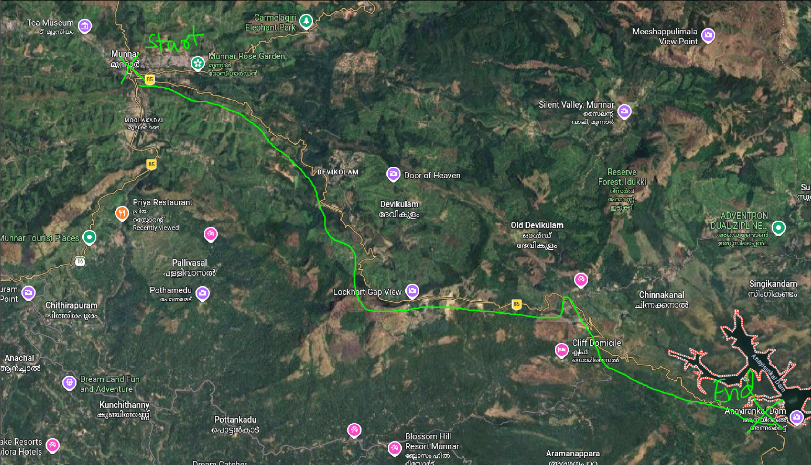

#### The Pine Place and the Christian Statue

Many people fixated on the "Priya Restaurant" that appears on the map. Unfortunately, the specific Priya Restaurant mentioned in the blog has no online presence and does not even appear on Google Street View. The blog provides more detail:

> "Priya Restaurant, I won't forget this detail. That was the place we ate at that night. It was next to a fancy pine-like place --- they refused to give us food. The bus stopped near there too, next to a Christian ... something --- I'm not sure what it was exactly, but there was a statue inside a glass case. The walk to our stay was about 1 km. I remember, on the way back, when we turned right, Draken slipped on the mud. It was so funny; me and trovador watched him fall in slow motion."

*"A fancy pine-like place --- they refused to give us food."* This suggests a food establishment of some kind. Searching for "pine hotel" or "pine restaurant" near the narrowed route returns two results. The ones near the Priya Restaurant are not food places.

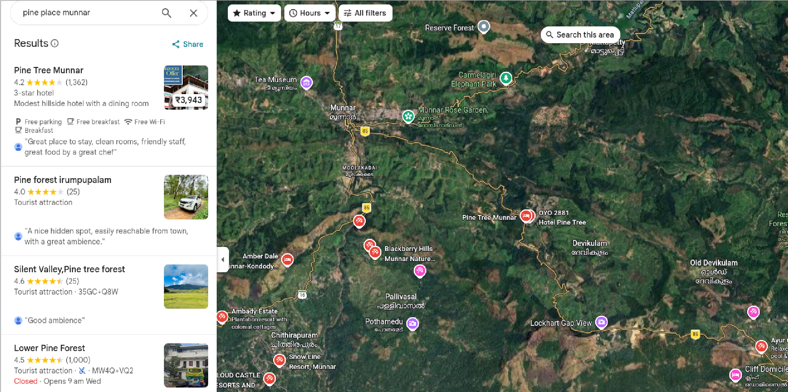

#### Devikulam Junction and Street View

We still need to find *"a Christian something --- a statue inside a glass case"*. A Street View check of the route reveals it.

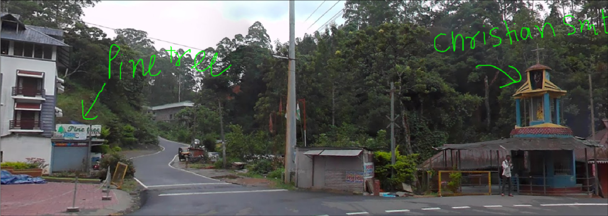

*"The bus stopped around that place too"*: the same Street View confirms a bus stopping there.

#### Identifying the Stay

Now for the final inference: guess and verify. From the blog:

> "The walk was about 1 km. I remember, on the way back, we turned right."

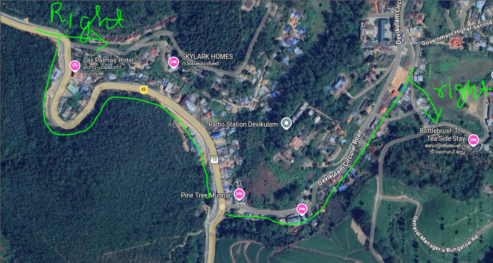

Trying the phone numbers of these two stays as flag values, the correct one is the phone number of **Skylark Homes**.

> **Flag Part 3 (sample values):** `9447192851`   `9447332138`   `6238958248`

---

## Complete Flags

```
apoorvctf{gggeb_C0d3_f0rc3s_9447192851}
apoorvctf{gggeb_C0d3_f0rc3s_9447332138}
apoorvctf{gggeb_C0d3_f0rc3s_6238958248}
```
