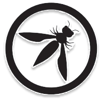
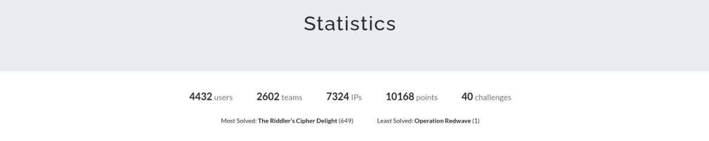

<h1 align="center">
    
    
        Cyber Security Club
    
    
</h1>

# ApoorvCTF-26-Writeups

This is a repository for all the writeups of ApoorvCTF'26.

### Flag Format

`apoorvctf{FLAG}`

### Winners:

1. Team BITSkrieg - 9168 pts
2. Team asgama - 8673 pts
3. Team TRISHUL CYBER SYNDICATS - 8668 pts

Special mentions:

4. Team Kosovo Albania Cyber Team - 8668 pts
5. Team DIGGAJ - 8668 pts

### Stats

