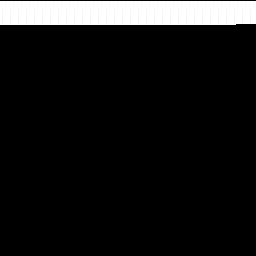
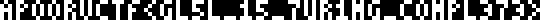

# Draw Me

**Challenge Writeup**

| | |
|---|---|
| **CTF:** | apoorvCTF |
| **Category:** | Reverse Engineering / Misc |
| **Difficulty:** | Hard |
| **Author:** | makeki |
| **Flag:** | `apoorvctf{gl5l_15_7ur1ng_c0mpl373}` |

---

## Description

*"Draw me, just draw me."* The bat has been watching. Across centuries, across wars, across history, it always shows up. And now it has left you something: a cryptic shader program and a black image. Nothing renders. Nothing makes sense. The bat is in there somewhere, waiting to be drawn.

**Files provided:** `challenge.glsl`, `program.png`, `runner.html`

---

## Solution

### 1. What Are We Looking At?

The challenge provides three files. The `runner.html` loads `challenge.glsl` as a WebGL fragment shader and feeds it `program.png` as a texture, rendering to a canvas. Opening it in a browser produces a completely black canvas.

`program.png` is a 256×256 image.



The first instinct might be image steganography. The PNG is entirely black; that goes nowhere. The shader is where everything lives.

### 2. Reading the Shader

The fragment shader `challenge.glsl` runs on every pixel of the canvas every frame. Instead of simply coloring pixels, it **simulates a CPU**: each frame, every pixel executes the same 16-instruction loop in software, then decides whether it is the write target of any of those instructions. The GPU's parallelism is being abused to implement a von Neumann machine inside a single shader.

### 3. The Memory Map

The 256×256 texture is divided into regions:

| Region | Contents |
|---|---|
| `(0, 0)` | Instruction Pointer: R = IP.x, G = IP.y |
| `(1–32, 0)` | Registers R1–R32 (R channel = value) |
| `(0–255, 1–127)` | Code segment (each pixel = one instruction) |
| `(0–255, 128–255)` | VRAM (what gets displayed) |

Each code-segment pixel encodes a 4-byte instruction: **R** = opcode, **G** = arg1, **B** = arg2, **A** = arg3.

#### Opcode Table

| Code | Instruction | Effect |
|---|---|---|
| 0 | `NOP` | No operation |
| 1 | `MOVI a1, a2` | `R[a1] = a2` |
| 2 | `ADD a1, a2, a3` | `R[a1] = (R[a2] + R[a3]) % 256` |
| 3 | `SUB a1, a2, a3` | `R[a1] = (R[a2] - R[a3] + 256) % 256` |
| 4 | `XOR a1, a2, a3` | `R[a1] = R[a2] ^ R[a3]` |
| 5 | `JMP a1, a2` | `IP = (a1, a2)` |
| 6 | `JNZ a1, a2, a3` | `if R[a1] != 0: IP = (a2, a3)` |
| 7 | `DRAW a1, a2, a3` | `VRAM[R[a1], R[a2]+128] = grey(R[a3])` |
| 8 | `STORE a1, a2, a3` | `MEM[R[a1], R[a2]] = (R[a3..a3+3])` |
| 9 | `LOAD a1, a2, a3` | `R[a1] = MEM[R[a2], R[a3]].r` |

`STORE` is the critical instruction: it writes a full 4-channel pixel to *any* memory location, including the code segment. This is **self-modifying code**.

### 4. Disassembling the ROM

A short Python script opens `program.png` with Pillow and reads raw RGBA bytes, mapping each pixel to its instruction via the opcode table. The very first instructions at the start of the code segment immediately reveal the structure:

```
(0,1): MOVI R1, 90      ; load the XOR key (0x5A)
(1,1): JMP 251, 8       ; jump into the decryption loop
```

The program loads `90` into R1 as the XOR key and immediately jumps to row 8, column 251. Execution never falls through rows 1–8 directly; those rows contain the draw code, which is only reached after decryption.

### 5. The Self-Modifying Decryption Loop

Starting at `(251, 8)` and continuing through rows 9–24, the ROM contains repeating 8-instruction groups:

```
[0]: MOVI R10, 4          ; opcode field for MOVI instruction
[1]: ADD  R11, R4, R0     ; R11 = XOR result from previous iteration
[2]: STORE R5, R6, R9     ; patch MEM[R5][R6] with (R9,R10,R11,R12)
[3]: MOVI R8, <key>       ; load encrypted color byte (90 or 165)
[4]: XOR  R4, R8, R1      ; decrypt: result = key XOR 90 -> 0 or 255
[5]: MOVI R5, <target_x>  ; x position to patch in code
[6]: MOVI R6, <target_row>; row to patch in code
[7]: MOVI R9, 1           ; opcode 1 = MOVI
```

There are 510 of these groups across rows 9–24. At `(235, 24)`, a `JMP 2, 1` sends execution back into the draw code.

What this loop does: it XOR-decrypts a 1-bit-per-pixel bitmap. Each group takes an encrypted byte (either 90 or 165), XORs it with the key `90`, and gets either `0` (black) or `255` (white). It then uses `STORE` to patch a `MOVI R4, <color>` instruction into the draw code at rows 1–8.

The cipher is trivially a 1-bit XOR: `90 XOR 90 = 0` (black pixel), `165 XOR 90 = 255` (white pixel). The key `90` sits in plain sight at instruction `(0,1)`.

### 6. The Draw Code

Rows 1–8 contain 510 draw groups, each 4 instructions:

```
MOVI R4, ?       <- patched by the STORE loop (0 or 255)
MOVI R2, <x>     ; VRAM x coordinate
MOVI R3, <y>     ; VRAM y offset (final address = y + 128)
DRAW R2, R3, R4  ; write color to VRAM
```

After the STORE loop patches all 510 `MOVI R4` instructions and jumps to `(2,1)`, execution runs sequentially through rows 1–8, firing all 510 `DRAW` calls and painting the flag image into VRAM.

### 7. Extracting the Flag

The extraction script:

1. Opens `program.png` and reads it as a numpy array.
2. Reads the initializer at `(251–255, 8)` to get the first XOR key and target position.
3. Iterates all 510 STORE groups in rows 9–24, extracting `(encrypted_key, target_x, target_row)` per group.
4. Computes `color = key XOR 90` for each (gives 0 or 255).
5. Reads the following `MOVI R2`/`MOVI R3` instructions to recover the actual VRAM coordinates.
6. Paints a canvas and saves it as `flag_output.png`.

The result is a 135×5 pixel image rendered in a 3×5 pixel bitmap font with 1-pixel gaps between characters.



### 8. Solution Script

The following Python script (requires Pillow and numpy) fully automates the extraction. Run it in the same directory as `program.png`:

```python
import numpy as np
from PIL import Image

img = Image.open('program.png').convert('RGBA')
mem = np.array(img)

R1 = 90  # XOR key loaded at (0,1)

# Read init values from row 8
init_key = int(mem[8, 251, 2])
init_tx  = int(mem[8, 253, 2])
init_tr  = int(mem[8, 254, 2])

# Iterate all 510 STORE groups in rows 9-24
draws = []
prev_xor = init_key ^ R1
prev_tx  = init_tx
prev_tr  = init_tr

for row in range(9, 25):
    for col_start in range(0, 256, 8):
        if col_start + 7 >= 256:
            break
        if int(mem[row, col_start + 2, 0]) != 8:  # STORE check
            break
        draws.append((prev_tx, prev_tr, prev_xor))
        new_key  = int(mem[row, col_start + 3, 2])
        prev_tx  = int(mem[row, col_start + 5, 2])
        prev_tr  = int(mem[row, col_start + 6, 2])
        prev_xor = new_key ^ R1

# Map patched MOVI R4 positions to VRAM coordinates
vram = {}
for (tx, tr, color) in draws:
    tx1 = (tx + 1) % 256
    tx2 = (tx + 2) % 256
    tr1 = tr + (1 if tx + 1 >= 256 else 0)
    tr2 = tr + (1 if tx + 2 >= 256 else 0)
    vx = int(mem[tr1, tx1, 2])
    vy = int(mem[tr2, tx2, 2])
    vram[(vx, vy + 128)] = color

# Render to image
xs = [p[0] for p in vram]; ys = [p[1] for p in vram]
min_x, max_x = min(xs), max(xs)
min_y, max_y = min(ys), max(ys)
canvas = np.zeros((max_y - min_y + 1, max_x - min_x + 1), dtype=np.uint8)
for (x, y), c in vram.items():
    canvas[y - min_y, x - min_x] = c

out = Image.fromarray(canvas, mode='L')
out.save('flag_output.png')
scale = 4
out.resize((canvas.shape[1]*scale, canvas.shape[0]*scale),
           Image.NEAREST).save('flag_output_big.png')
print('Saved flag_output.png and flag_output_big.png')
```

---

## Flag

```
apoorvctf{gl5l_15_7ur1ng_c0mpl373}
```
