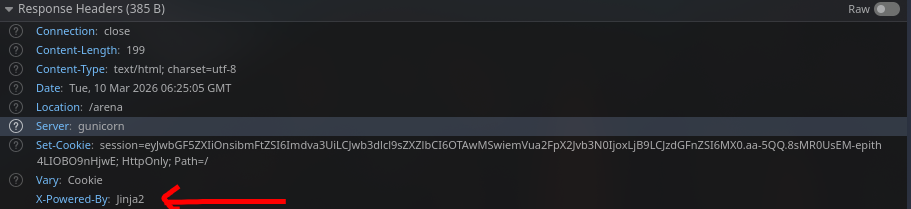
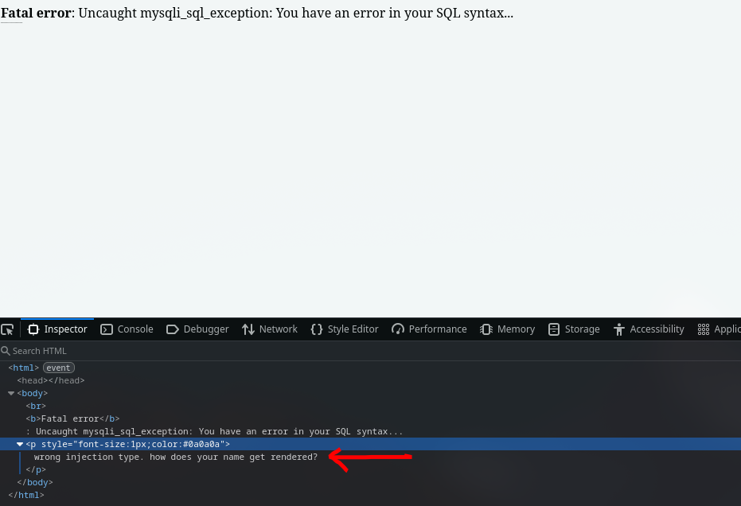
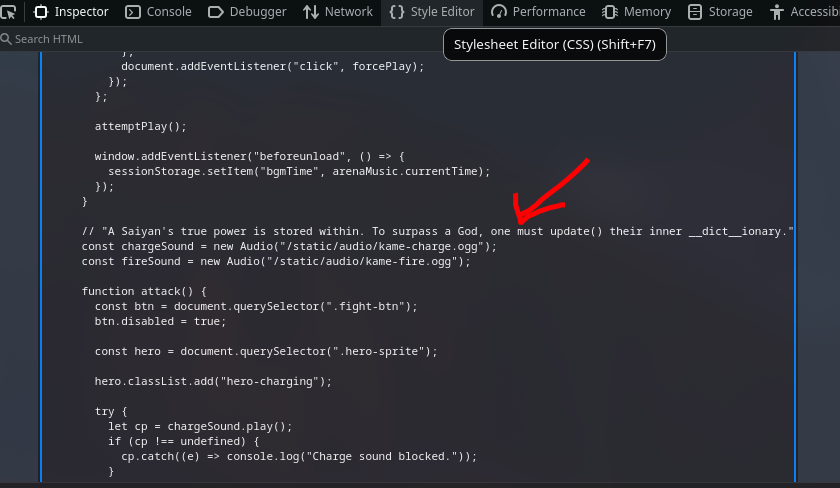
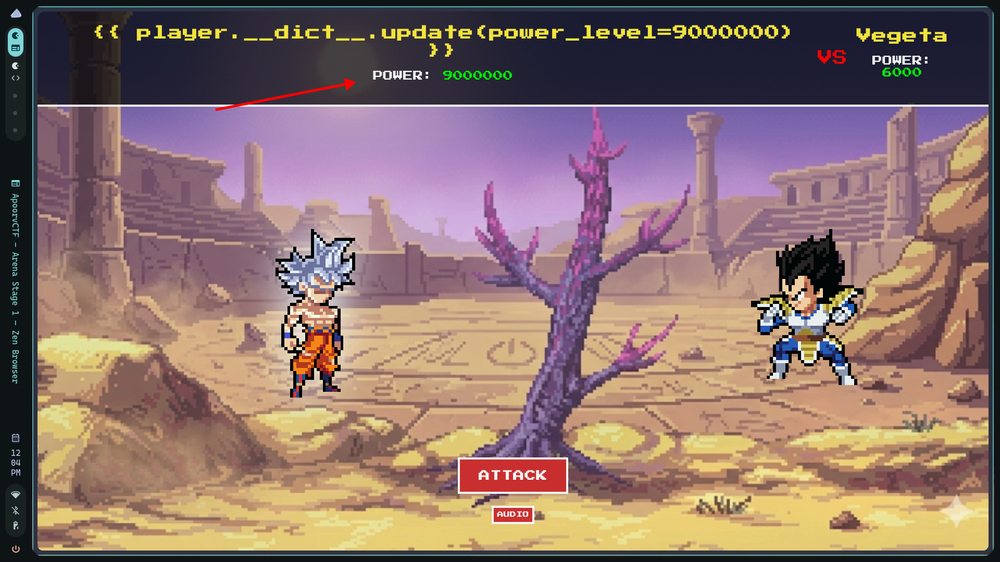
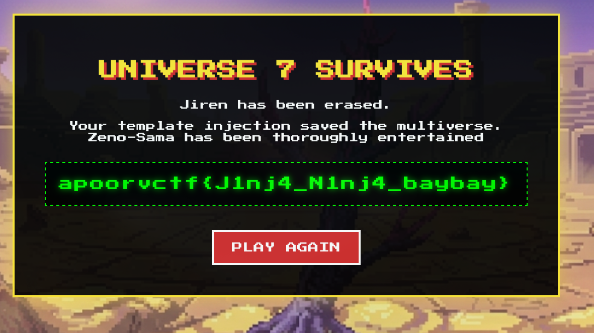

# KameHame-Hack -- CTF Writeup

**Category:** Web Exploitation  
**Difficulty:** Medium  
**Flag:** `apoorvctf{J1nj4_N1nj4_baybay}`

---

## Overview

KameHame-Hack is a Dragon Ball Z-themed web challenge built on Flask/Jinja2. The player enters a "fighter name" and is dropped into a 3-stage tournament against Vegeta (power: 6,000), Cell (power: 25,000), and Jiren (power: 1,000,000). The player starts at power level 9,001 and receives story boosts between stages, but these boosts max out at 70,000 -- far below the 1,000,000 needed to defeat Jiren. The only path to victory is exploiting a **blind Server-Side Template Injection (SSTI)** in the fighter name input to overwrite the player's power level.

The challenge layers multiple misdirections and restrictions to narrow down the attack surface to a single, specific payload.

---

## Reconnaissance

### Identifying the Tech Stack

Several indicators point to Jinja2 as the template engine:

1. **HTTP Response Header:** Every response includes `X-Powered-By: Jinja2`, visible in browser DevTools or curl.

<!-- [IMAGE PLACEHOLDER: Screenshot of browser DevTools Network tab showing the X-Powered-By: Jinja2 response header on any page response] -->


2. **HTML Source Comment:** The index page contains a comment in the `<head>`:
   ```html
   <!-- build:capsule-corp-v3.1 | engine:jinja2 | ctx:player -->
   ```
   This reveals both the engine (`jinja2`) and the template context variable (`player`).

### Identifying the Injection Point

The only user-controlled input is the **fighter name** submitted via POST to `/`. The application takes this string, creates a `Saiyan` object with it as the `name` attribute, and then passes it through `sandbox.from_string(name)` -- meaning the raw user input is **compiled and rendered as a Jinja2 template**.

---

## The Misdirection: Fake SQL Injection

Entering anything containing a single quote `'` or double quote `"` into the name field returns:

```
Fatal error: Uncaught mysqli_sql_exception: You have an error in your SQL syntax...
```

<!-- [IMAGE PLACEHOLDER: Screenshot of the fake SQL error page returned when entering a name with quotes, e.g., entering `test'` as the fighter name] -->

This is a deliberate red herring. The error is hardcoded and has nothing to do with a database as there is no database in this challenge at all. Inspecting the response closely reveals a hidden hint embedded in a nearly invisible `<p>` tag (font-size 1px, color almost matching the background):

```html
<p style="font-size:1px;color:#0a0a0a">wrong injection type. how does your name get rendered?</p>
```

<!-- [IMAGE PLACEHOLDER: Screenshot showing the tiny hidden text revealed by inspecting the page source or using browser DevTools element inspector on the fake SQL error page] -->


This explicitly tells the player: (1) SQL injection is the wrong vector, and (2) the rendering of the name is what matters.

### Why This Matters for SSTI

The quote filter is the **first gate** the input passes through:

```python
if "'" in name or '"' in name:
    return "<fake SQL error>", 200
```

This is checked *before* any template rendering occurs. The critical consequence: **the vast majority of standard SSTI payloads contain quotes and will never reach the template engine**. Payloads like `{{''.__class__.__mro__}}`, `{{config['SECRET_KEY']}}`, `{{"7"*7}}`, or any RCE chain involving `__import__('os')` are all killed at this stage, returning the fake SQL error instead.

---

## The Blind SSTI

### Understanding "Blind"

The core of the vulnerability is in the `/` POST handler:

```python
player = Saiyan(name)
try:
    template = sandbox.from_string(name)
    render_with_timeout(template, player=player)
except (RenderTimeout, MemoryError):
    pass
except Exception:
    pass

session['player'] = player.__dict__
```

Key observations:

1. **The render output is discarded.** The return value of `render_with_timeout()` is never used or displayed. The user is simply redirected to `/arena`.
2. **All errors are silently swallowed.** Whether the template raises a `SecurityError`, `UndefinedError`, or anything else, the `except Exception: pass` block catches it and continues.
3. **The player's `__dict__` is saved to the session after rendering.** This means any in-place mutation of the `player` object during template rendering persists into the game session.

This makes the injection **blind** -- you get no direct output from your template. A payload like `{{7*7}}` does execute and evaluate to `49`, but that result vanishes. The player's name in the arena HUD still displays the raw input string `{{7*7}}` because `player.name` was set to the literal input before rendering.

The only observable feedback channel is **side effects on the `player` object**, which is available in the template context.

### The Sandbox

The application uses a custom `CTFSandbox` extending Jinja2's `SandboxedEnvironment`. The `is_safe_attribute` method acts as a strict allowlist:

| Object Type | Allowed Attributes |
|---|---|
| `Saiyan` instance | `name`, `power_level`, `zenkai_boost`, `__dict__` |
| `dict` | `update`, `get`, `keys`, `values`, `items` |
| Everything else | **Blocked** |

Additionally:
- All Jinja2 built-in globals are stripped except `true`, `false`, `none`, and `range`.
- String and sequence multiplication via `*` is intercepted and blocked (prevents `{{"A"*999999}}` DoS).
- No Flask globals (`config`, `request`, `session`, `g`, `url_for`) are passed to the template context. The only context variable is `player`.

This means:
- **MRO traversal is dead.** `__class__`, `__mro__`, `__subclasses__`, `__init__`, `__globals__` are all blocked.
- **RCE is impossible.** There is no path to `os`, `subprocess`, or any dangerous module.
- **Information leakage is impossible.** No `config`, `request`, or `self` to exfiltrate from.

The sandbox is not broken. The intended solve **works within the sandbox's rules**.

---

## The Intended Solve

### Following the Hints

The arena page contains a JavaScript comment that serves as the key hint:

```javascript
// "A Saiyan's true power is stored within. To surpass a God, one must update() their inner __dict__ionary."
```

<!-- [IMAGE PLACEHOLDER: Screenshot of browser DevTools Sources tab or page source showing the JavaScript comment hint in arena.html] -->


Breaking this down:
- "true power is stored within" → the power level is an attribute inside the player object
- "update() their inner __dict__ionary" → use `__dict__.update()` to modify the player's attributes

### The Payload

```
{{ player.__dict__.update(power_level=9999999) }}
```

**Why this payload works within every constraint:**

1. **No quotes.** It passes the SQLi filter cleanly.
2. **`player.__dict__` access is allowed.** The sandbox explicitly permits `__dict__` on `Saiyan` instances.
3. **`dict.update()` is allowed.** The sandbox permits `update` on dict objects.
4. **Keyword argument `power_level=9999999` uses no quotes.** It is a valid Python/Jinja2 keyword argument with an integer value.
5. **Side effect persists.** `dict.update()` mutates the dictionary in-place. Since `player.__dict__` *is* the object's internal attribute dictionary, this directly overwrites `player.power_level` to 9,999,999. After rendering, `session['player'] = player.__dict__` saves the mutated state.

The template renders `None` as its output (since `dict.update()` returns `None`), but that output is discarded anyway. What matters is the mutation.

### Winning the Game

1. Enter `{{ player.__dict__.update(power_level=9999999) }}` as the fighter name.
2. You are redirected to the arena. Your power level now reads **9,999,999** in the HUD -- well above Jiren's 1,000,000.
3. Goku's sprite transforms into **Ultra Instinct** form (the code triggers this when `power_level > 1,000,000`).
4. Click ATTACK three times to defeat Vegeta, Cell, and Jiren in sequence.
5. After defeating Jiren (stage > 3), the flag page renders:

```
apoorvctf{J1nj4_N1nj4_baybay}
```

<!-- [IMAGE PLACEHOLDER: Screenshot of the arena page after entering the payload, showing the player name as the raw payload string and power level as 9999999, with the Ultra Instinct Goku sprite] -->


<!-- [IMAGE PLACEHOLDER: Screenshot of the victory/flag page showing "UNIVERSE 7 SURVIVES" and the flag in the green dashed box] -->


---

## Why Most SSTI Payloads Fail: A Breakdown

This is the most instructive part of the challenge. Payloads fall into exactly three behavioral categories, gated by three sequential filters:

### Filter 1: The Quote Check (Fake SQLi)

**Behavior:** Returns a fake SQL error page. The template engine is never reached.

| Payload | Why it hits this filter |
|---|---|
| `{{''.__class__.__mro__[1].__subclasses__()}}` | Contains `''` (single quotes) |
| `{{config['SECRET_KEY']}}` | Contains `'` (single quotes) |
| `{{"7"*7}}` | Contains `"` (double quotes) |
| `{{request.application.__globals__.__builtins__.__import__('os').popen('id').read()}}` | Contains `'` (single quotes) |
| `' OR 1=1 --` | Contains `'` (single quote) |
| `{{lipsum.__globals__["os"].popen("id").read()}}` | Contains `"` (double quotes) |

Almost every SSTI payload from cheat sheets (HackTricks, PayloadsAllTheThings, etc.) falls here because string manipulation, dictionary key access, and function calls with string arguments all require quotes.

### Filter 2: The Sandbox (Silent Failure)

**Behavior:** The template engine is reached, but the sandbox blocks the attribute access. A `SecurityError` is raised and silently caught. The player is registered with default stats as if nothing happened.

| Payload | Why the sandbox blocks it |
|---|---|
| `{{player.__class__}}` | `__class__` not in the allowlist for Saiyan |
| `{{player.__init__.__globals__}}` | `__init__` not in the allowlist |
| `{{().__class__.__bases__}}` | `__class__` not allowed on tuple; also `__bases__` blocked |
| `{{range.__class__}}` | `__class__` not allowed on range |
| `{{player.__dict__.__class__}}` | `__class__` not allowed on dict objects |
| `{{cycler.__init__.__globals__}}` | `cycler` not available (builtins stripped) |

These payloads survive the quote check but are neutered by the attribute allowlist. The error is swallowed, so the player sees no feedback at all -- just a normal game start with power 9,001.

### Filter 3: Output Discarded (No Visible Effect)

**Behavior:** The template renders successfully, but the output goes nowhere. The player is registered with default stats.

| Payload | What happens |
|---|---|
| `{{7*7}}` | Evaluates to `49`. Output discarded. No side effect. |
| `{{7+7}}` | Evaluates to `14`. Output discarded. No side effect. |
| `{{player.name}}` | Evaluates to the name string itself. Output discarded. |
| `{{player.power_level}}` | Evaluates to `9001`. Output discarded. |
| `{{range(10)}}` | Evaluates to a range object's string repr. Output discarded. |

These payloads prove SSTI *is present* (the expressions are evaluated), but since the rendering is blind, there is no way to observe the result. They produce no mutation of the player object, so the game state is unchanged.

### The Sole Survivor: Mutation via Side Effect

| Payload | What happens |
|---|---|
| `{{ player.__dict__.update(power_level=9999999) }}` | Mutates `player.power_level` in-place. Persists to session. **Game is won.** |

This is the only category that produces an observable effect. The payload does not need output to be displayed -- it exploits the fact that the `player` object is shared between the template rendering context and the session serialization that follows it.

---

## Summary of the Kill Chain

```
Name Input
    │
    ├── Contains ' or " ?  ──YES──▶  Fake SQLi error (red herring)
    │
    NO
    │
    ▼
Jinja2 Sandbox Render (blind)
    │
    ├── Accesses blocked attribute?  ──YES──▶  SecurityError caught silently
    │
    NO
    │
    ├── Read-only expression?  ──YES──▶  Output discarded, no effect
    │
    NO
    │
    ▼
Mutates player.__dict__ ──▶ power_level overwritten ──▶ Session saved ──▶ Win all stages ──▶ FLAG
```

---

## Key Takeaways

1. **Not all SSTI is about RCE.** This challenge demonstrates that SSTI can be exploited purely through **object mutation** without any code execution, file reads, or information leakage.

2. **Blind SSTI is viable when shared mutable state exists.** The `player` object bridges the gap between the template context and the application state. Even though the template output is thrown away, the side effect on the shared object persists.

3. **Sandboxes restrict, but do not eliminate, SSTI impact.** The sandbox correctly blocks all MRO traversal and RCE chains. But it intentionally leaves `__dict__` and `dict.update()` accessible -- because the challenge requires exactly this narrow path.

4. **Misdirection is effective.** The fake SQLi error eliminates the most common payloads while simultaneously sending players down the wrong rabbit hole. The hidden hint in the error page is the breadcrumb back to the correct path.

5. **Read the source hints.** The HTML comment (`engine:jinja2 | ctx:player`), the response header (`X-Powered-By: Jinja2`), and the JavaScript comment about `update()` and `__dict__ionary` collectively spell out the entire exploit path for anyone paying attention.

